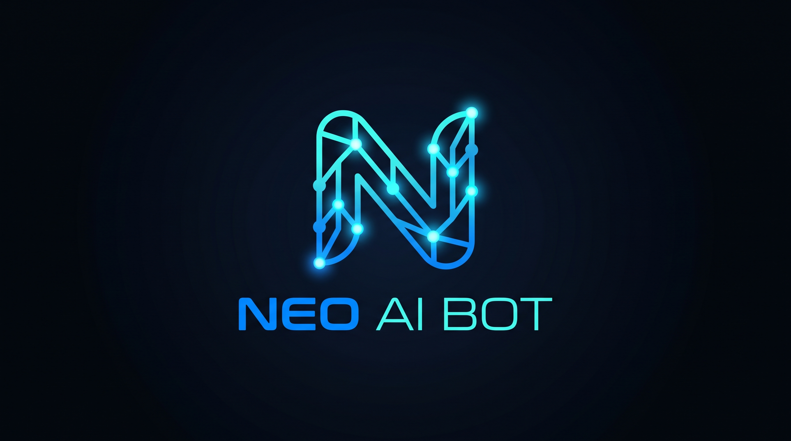
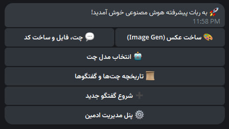

<div align="center">



# 🤖 Neo AI Bot

**ربات هوش مصنوعی پیشرفته تلگرام؛ پایدار، رایگان و بهینه‌سازی‌شده برای Cloudflare Workers + Upstash Redis**

[](https://t.me/NeoTenet)
[](https://workers.cloudflare.com/)
[](https://upstash.com/)
[](https://core.telegram.org/bots/api)
[](LICENSE)

**[پیش‌نمایش](#-پیشنمایش-محیط-ربات-و-پنل) • [ویژگی‌ها](#-ویژگیهای-کلیدی) • [معماری پروژه](#-معماری-پردازش-و-دیتابیس) • [پیش‌نیازها](#-پیشنیازها) • [راه‌اندازی](#-راهنمای-گامبهگام-راهاندازی) • [Secrets](#-تنظیمات-و-کلیدهای-امنیتی-secrets) • [Webhook](#-تنظیم-webhook) • [عیبیابی](#-عیبیابی-و-نکات-مهم) • [سازنده](#-سازنده-و-کانال-توسعهدهنده)**

</div>

---

<div dir="rtl">

## 📖 درباره پروژه

**Neo AI Bot** یک ربات هوش مصنوعی چندمنظوره برای تلگرام است که روی زیرساخت Serverless سرویس **Cloudflare Workers** به همراه دیتابیس ابری **Upstash Redis REST API** اجرا می‌شود.

این پروژه برای پردازش‌های پس‌زمینه از `ctx.waitUntil` استفاده می‌کند تا درخواست وب‌هوک تلگرام سریع تأیید شود و پردازش‌های طولانی‌تر در پس‌زمینه ادامه پیدا کنند. مدت‌زمان واقعی پردازش به محدودیت‌های فعلی Cloudflare، نحوه اجرای Worker و API سرویس هوش مصنوعی وابسته است؛ بنابراین زمان ۵۵ ثانیه تضمین‌شده نیست.

با استفاده از **Upstash Redis REST API**، تاریخچه گفتگوها، جلسات و تنظیمات موردنیاز ربات در دیتابیس ابری ذخیره می‌شوند. محدودیت‌ها و سهمیه‌های پلن Upstash همچنان اعمال می‌شوند.

> 💡 **هدف پروژه:** راه‌اندازی یک ربات هوش مصنوعی تلگرامی با زیرساخت Serverless، بدون نیاز به VPS اختصاصی.

---

## 📸 پیش‌نمایش محیط ربات و پنل

<div align="center">



<sub>نمای پنل مدیریت، انتخاب مدل‌ها و پاسخ‌دهی ربات Neo AI Bot</sub>

</div>

> برای نمایش تصاویر، فایل‌های `logo.png` و `panel-screenshot.jpg` را در ریشه Repository قرار دهید.

---

## ✨ ویژگی‌های کلیدی

- ⚡ **پاسخ سریع به وب‌هوک** — امکان تأیید سریع درخواست تلگرام و ادامه پردازش در پس‌زمینه با `ctx.waitUntil`، مشروط به پیاده‌سازی کد و محدودیت‌های پلتفرم.
- 🗃️ **دیتابیس Upstash Redis REST API** — ذخیره تاریخچه چت، جلسات و تنظیمات در Redis از طریق REST API.
- 🧠 **پشتیبانی از چندین مدل AI** — امکان مدیریت مدل‌های متنی، کدنویسی، Vision و تولید تصویر، در صورت پیکربندی Providerهای سازگار.
- 💬 **مدیریت تاریخچه و جلسات چت** — ساخت گفتگوی جدید، جابه‌جایی بین گفتگوهای قبلی و ذخیره تاریخچه، مطابق قابلیت‌های پیاده‌سازی‌شده در نسخه پروژه.
- 🛠️ **پنل مدیریت ادمین** — مدیریت مدل‌ها، کاربران، مسدودسازی و اسپانسرینگ، در صورت فعال بودن این امکانات در کد.
- 📢 **قفل عضویت کانال اسپانسر** — امکان الزام کاربر به عضویت در کانال‌های مشخص‌شده.
- 👥 **پشتیبانی از گروه‌ها** — امکان تشخیص Mention و پاسخ در گروه، در صورت فعال بودن این قابلیت.
- 📄 **تحلیل فایل و سورس‌کد** — امکان ارسال فایل‌هایی مانند `.js`، `.py`، `.json` و `.txt` برای تحلیل، با توجه به محدودیت‌های Provider.
- 🔐 **مدیریت امن Secrets** — نگهداری Tokenها و کلیدهای API در تنظیمات محیطی Cloudflare، نه در سورس عمومی.

---

## 🏗️ معماری پردازش و دیتابیس

این پروژه از سه بخش اصلی تشکیل می‌شود:

1. **Telegram Bot API:** پیام‌ها را از طریق Webhook به Worker ارسال می‌کند.
2. **Cloudflare Workers:** درخواست را پردازش می‌کند و در صورت پیاده‌سازی، با `ctx.waitUntil` کارهای پس‌زمینه را ادامه می‌دهد.
3. **Upstash Redis REST API و AI Provider:** Redis برای داده‌های موردنیاز ربات و سرویس هوش مصنوعی برای تولید پاسخ استفاده می‌شود.

```text
                 ┌──────────────────┐
                 │     Telegram     │
                 │      Bot API     │
                 └────────┬─────────┘
                          │
                   Webhook Request
                          │
                          ▼
                 ┌──────────────────┐
                 │ Cloudflare       │
                 │ Worker           │
                 │ (ctx.waitUntil)  │
                 └────────┬─────────┘
                          │
              ┌───────────┴───────────┐
              │                       │
              ▼                       ▼
      ┌────────────────┐     ┌────────────────┐
      │ Upstash Redis  │     │ AI Provider    │
      │ REST API       │     │ API Endpoint   │
      └────────────────┘     └────────────────┘
```

> **نکته فنی:** `ctx.waitUntil` به‌تنهایی محدودیت اجرای Worker را حذف نمی‌کند و تضمین نمی‌کند که پردازش دقیقاً ۵۵ ثانیه ادامه یابد. مدت مجاز اجرا و محدودیت‌های CPU/زمان را در مستندات روز Cloudflare بررسی کنید.

---

## 🧰 پیش‌نیازها

| مورد | توضیح |
|---|---|
| 🤖 Telegram Bot | دریافت Token از [@BotFather](https://t.me/BotFather) |
| 🗃️ Upstash Redis | ساخت دیتابیس در [Upstash](https://upstash.com/) و دریافت REST URL و Token |
| 👤 Admin ID | شناسه عددی ادمین؛ برای نمونه از [@userinfobot](https://t.me/userinfobot) کمک بگیرید |
| ☁️ Cloudflare Account | حساب Cloudflare برای ساخت Worker |
| 🧠 AI API | کلید API و Endpoint سرویس هوش مصنوعی مورد استفاده در کد |

---

## 🚀 راهنمای گام‌به‌گام راه‌اندازی

### ۱. ساخت دیتابیس Upstash Redis

1. وارد [Upstash.com](https://upstash.com/) شوید و حساب بسازید.
2. روی **Create Database** کلیک کنید.
3. نام دیتابیس و منطقه جغرافیایی مناسب را انتخاب کنید.
4. پس از ساخت دیتابیس، بخش REST API را باز کنید.
5. این دو مقدار را بردارید و محرمانه نگه دارید:
   - `UPSTASH_REDIS_REST_URL`
   - `UPSTASH_REDIS_REST_TOKEN`

### ۲. ساخت Cloudflare Worker

1. وارد [Cloudflare Dashboard](https://dash.cloudflare.com/) شوید.
2. به **Workers & Pages** بروید و یک Worker جدید بسازید.
3. نام دلخواه را انتخاب کرده و Worker را Deploy کنید.
4. بخش **Edit Code** را باز کنید.
5. محتوای فایل `worker.js` را جایگزین کد پیش‌فرض کنید.
6. روی **Save and Deploy** کلیک کنید.

### ۳. تنظیم متغیرهای محیطی (Secrets)

در داشبورد Cloudflare مسیر زیر را باز کنید:

`Workers & Pages` → `Your Worker` → `Settings` → `Variables`

متغیرهای زیر را اضافه کنید. نام‌ها باید با نام‌هایی که در کد خوانده می‌شوند دقیقاً مطابقت داشته باشند.

| Variable | توضیحات | نمونه |
|---|---|---|
| `BOT_TOKEN` | توکن ربات تلگرام | `123456789:ABC...` |
| `ADMIN_ID` | شناسه عددی ادمین | `987654321` |
| `UPSTASH_URL` | آدرس REST دیتابیس Upstash | `https://xxxx-xxxxx.upstash.io` |
| `UPSTASH_TOKEN` | توکن REST دیتابیس Upstash | `REDACTED...` |

> در این README از نام‌های `UPSTASH_URL` و `UPSTASH_TOKEN` استفاده شده است. اگر کد شما نام‌های `UPSTASH_REDIS_REST_URL` و `UPSTASH_REDIS_REST_TOKEN` را می‌خواند، همان نام‌های مورد انتظار کد را تنظیم کنید یا کد و README را با هم هماهنگ کنید.

پس از افزودن متغیرها، Worker را ذخیره و Deploy کنید.

---

## 🔗 تنظیم Webhook

پس از Deploy شدن Worker و ثبت متغیرهای محیطی، باید Telegram را به آدرس Worker متصل کنید.

این الگو را در مرورگر باز کنید و مقادیر نمونه را با اطلاعات واقعی خود جایگزین کنید:

```text
https://api.telegram.org/bot<YOUR_BOT_TOKEN>/setWebhook?url=https://<YOUR_WORKER_NAME>.<YOUR_SUBDOMAIN>.workers.dev/
```

در صورت موفقیت، پاسخ تلگرام مشابه این خواهد بود:

```json
{
  "ok": true,
  "result": true,
  "description": "Webhook was set"
}
```

### بررسی وضعیت Webhook

```text
https://api.telegram.org/bot<YOUR_BOT_TOKEN>/getWebhookInfo
```

در خروجی، مقدار `url` و در صورت وجود، `last_error_message` را بررسی کنید.

### حذف Webhook

در صورت نیاز به حذف اتصال فعلی:

```text
https://api.telegram.org/bot<YOUR_BOT_TOKEN>/deleteWebhook
```

> 🔐 آدرس‌های بالا حاوی Token ربات هستند. آن‌ها را در Issue، اسکرین‌شات یا پیام عمومی منتشر نکنید.

---

## 🔐 نکات امنیتی

- هیچ‌وقت `BOT_TOKEN` یا `UPSTASH_TOKEN` را در GitHub عمومی قرار ندهید.
- کلید API هوش مصنوعی را در Cloudflare Secrets نگهداری کنید.
- دسترسی به تنظیمات Worker را فقط به افراد مورد اعتماد بدهید.
- اگر Token افشا شد، آن را فوراً تعویض کنید.
- پیش از انتشار اسکرین‌شات، Tokenها، شناسه‌های حساس و اطلاعات خصوصی را بپوشانید.
- از قرار دادن اطلاعات واقعی در نمونه‌های README خودداری کنید.

---

## 🩺 عیب‌یابی و نکات مهم

### ❌ ربات پس از ارسال پیام پاسخ نمی‌دهد

1. وضعیت Webhook را با `getWebhookInfo` بررسی کنید.
2. مطمئن شوید URL Worker درست است و Worker با موفقیت Deploy شده.
3. مقدار `BOT_TOKEN` را بررسی کنید.
4. لاگ‌های Worker را در داشبورد Cloudflare بازبینی کنید.
5. مطمئن شوید متغیرهای Upstash با نام مورد انتظار کد ثبت شده‌اند.

### ❌ خطای `Unauthorized`

- Token ربات را در [@BotFather](https://t.me/BotFather) بررسی یا تعویض کنید.
- مقدار `BOT_TOKEN` را در Cloudflare به‌روزرسانی کنید.
- پس از تغییر تنظیمات، Worker را مجدداً Deploy کنید.

### ❌ خطای Upstash یا Redis

- URL باید آدرس REST معتبر دیتابیس باشد.
- Token باید متعلق به همان دیتابیس باشد.
- فضای خالی ابتدا یا انتهای مقادیر را حذف کنید.
- سهمیه، محدودیت نرخ و وضعیت سرویس Upstash را بررسی کنید.
- نام متغیرهای Cloudflare را با نام‌های مورد استفاده در کد تطبیق دهید.

### ❌ خطای API هوش مصنوعی

- اعتبار `AI_API_KEY` را بررسی کنید.
- فعال بودن API، سهمیه و محدودیت نرخ سرویس را بررسی کنید.
- Endpoint و شناسه مدل باید با Provider انتخاب‌شده سازگار باشند.
- خطاهای `429` و `5xx` را در لاگ‌ها بررسی کنید.

### ❌ خطای محدودیت زمان اجرا

`ctx.waitUntil` محدودیت‌های Cloudflare Workers را حذف نمی‌کند. اگر درخواست AI طولانی است:

- مدت زمان و محدودیت‌های فعلی Worker را بررسی کنید.
- از پردازش پس‌زمینه مطابق مستندات پلتفرم استفاده کنید.
- برای کارهای طولانی، صف یا معماری پردازش مناسب‌تری در نظر بگیرید.
- مطمئن شوید کار پس‌زمینه در زمان مجاز کامل می‌شود.

### ⏳ تایمر وضعیت «در حال فکر کردن...»

اگر رابط ربات پیام وضعیت یا تایمر کوتاه نمایش می‌دهد، مدت آن باید با منطق واقعی کد هماهنگ باشد. پیام وضعیت به‌تنهایی تضمین‌کننده جلوگیری از خطای `429 Too Many Requests` نیست؛ تعداد درخواست‌ها و محدودیت‌های Telegram Bot API را نیز مدیریت کنید.

---

## 🗂️ ساختار پیشنهادی Repository

```text
Neo-AI-Bot/
├── worker.js
├── README.md
├── LICENSE
├── logo.png
└── panel-screenshot.jpg
```

فایل‌های تصویری صرفاً برای نمایش README هستند. نام فایل‌ها را می‌توانید تغییر دهید، اما مسیرهای `src` در README را نیز به‌روزرسانی کنید.

---

## 🤝 مشارکت

برای گزارش مشکل یا پیشنهاد قابلیت جدید، می‌توانید Issue ثبت کنید یا Pull Request بفرستید.

پیش از ارسال تغییرات:

- [ ] کد را آزمایش کنید.
- [ ] هیچ Secret واقعی در Commit نباشد.
- [ ] توضیحات تغییرات را واضح بنویسید.
- [ ] سازگاری با Cloudflare Workers را بررسی کنید.

---

## 📜 مجوز (License)

این پروژه تحت مجوز **MIT** منتشر شده است. برای اطلاعات کامل، فایل [`LICENSE`](LICENSE) را ببینید.

---

## 👤 سازنده و کانال توسعه‌دهنده

این پروژه توسط **NeoTenet** توسعه داده شده است.

برای دریافت آموزش‌ها، آپدیت‌ها و پروژه‌های جدید:

<div align="center">

[](https://t.me/NeoTenet)

**📢 کانال توسعه‌دهنده:** [t.me/NeoTenet](https://t.me/NeoTenet)

### ⭐ اگر پروژه برایتان مفید بود، به Repository ستاره بدهید!

**Made with ❤️ by NeoTenet**

</div>
</div>
